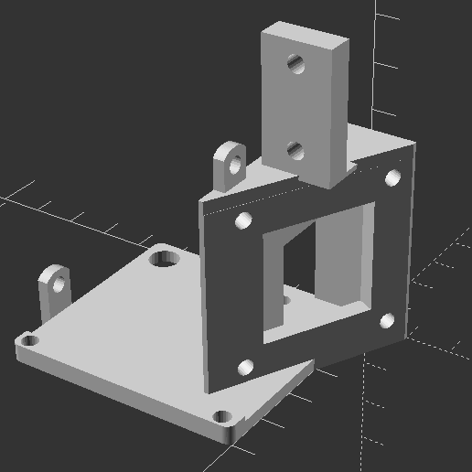
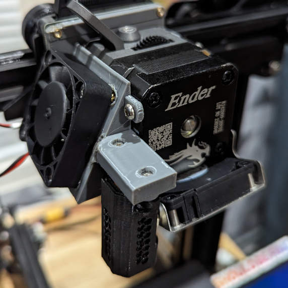
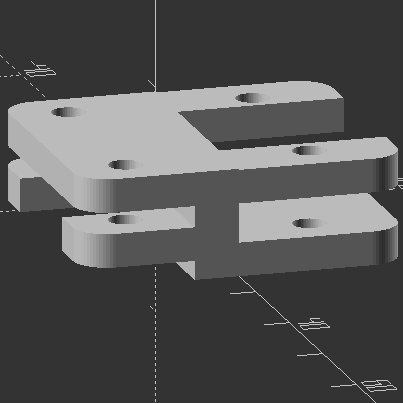
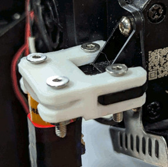

# Creality Sprite Pro 40mm Fan Duct
I broke my Sprite Pro hot end cooling fan, so I made a model so it fits a 40mm fan I had instead of a 30mm fan. I don't use this anymore since I have a new 30mm fan and board now, but it worked well for a while. Here's the model if anyone else needs it. I used heat inserts to fit the screws for the board, fan and BLTouch.

 

You can download the model at the [Releases tab](https://github.com/diademiemi/3d_printer_configs_ender3/releases/tag/2023-10-28)

# Creality Sprite Pro BLTouch Raiser
The BLTouch I use was too low, it kept bumping into prints and especially the bed clips, so I made a model to raise it by 3.5 millimeters. This will offset the Z axis by 3.5 millimeters, X axis by 13.5 millimeters and Y axis by 0 millimeters.

 
